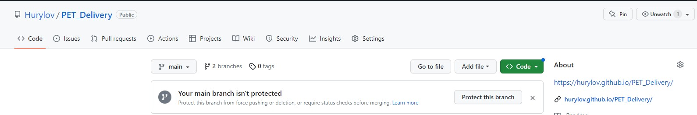
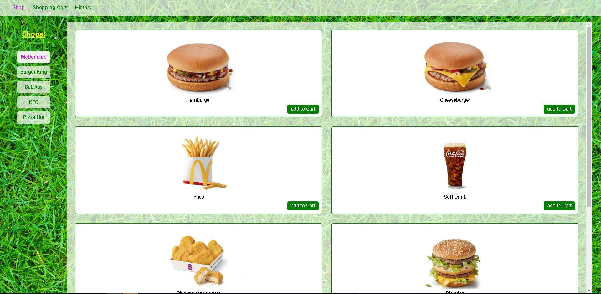

# Delivery

This is a repository for the PET Delivery project, an online food delivery
service.

---

## How to use

### Use on-line

To use the application online, you can use a direct link on GitHub:

Or faster you can use this link:
**[https://hurylov.github.io/PET_Delivery/](https://hurylov.github.io/PET_Delivery/)**

### Use localy

To use the application localy, follow next steps:

1. Clone the repository to your computer: `git clone`
   *https://github.com/hurylov/PET_Delivery*
2. Navigate to the project directory: `cd UserCardFollowers`
3. Install dependencies of project: input `npm install` in console.
4. Start the development server: `npm start`
5. It will open a new tab in the your browser: _http://localhost:3000_.

#### If you have done everything correctly, you will see the following pages:

---

## Technologies

The project is built with [React](https://react.dev/) using
[Axios](https://axios-http.com/) library to interact with
[MongoDB](https://www.mongodb.com/), Express.js and Node.js to develop the back
end of the application and styled by
[Styled-components](https://styled-components.com/).

---

## Back-end part

*https://github.com/hurylov/delivery-food-API *

To work locally, create a .env file and specify the necessary environment
variables in it (following the example in .env.expample).

---

## Developed by:

_Junior Frontend Developer - Dmytro Hurylov_:
**[GitHub](https://github.com/hurylov)**,
**[Linkedin](https://www.linkedin.com/feed/)**

---
